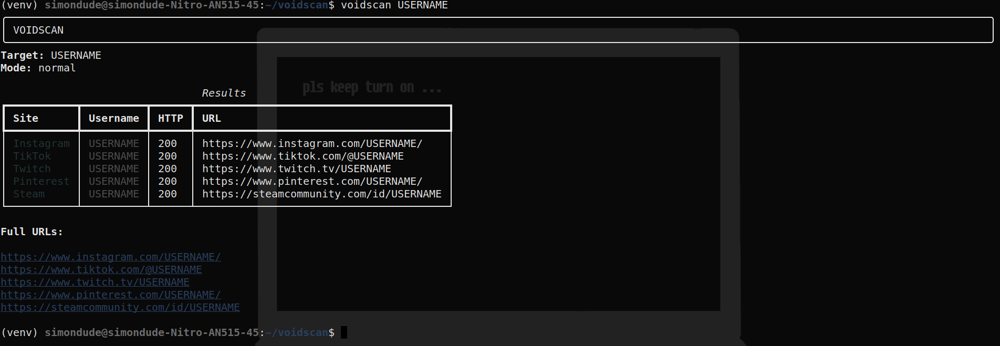
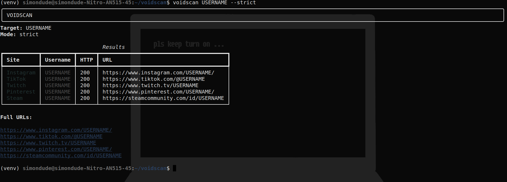
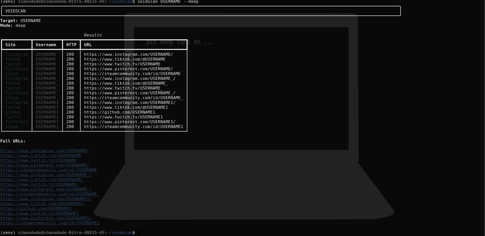
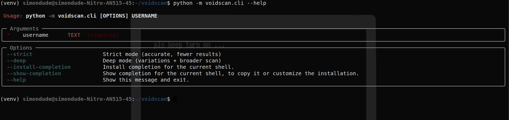

# VoidScan

🇺🇸 Read in English: [README](README.md)

Scanner OSINT Experimental de Usernames

---

## Funcionalidades

- Varredura assíncrona (async)
- Modos Normal, Strict e Deep
- Geração automática de variações de username
- Interface CLI
- Arquitetura modular
- Instalável via pip

---

## 🖥 Sistemas Operacionais Suportados

- Linux
- Windows
- macOS
- Termux (Android)
- Qualquer sistema com Python 3.10+

---

## Instalação e Uso

```bash
# Instalar via pip
pip install voidscan

# ou instalar pelo código-fonte
git clone https://github.com/secretman12-lang/voidscan.git
cd voidscan
python3 -m venv venv
source venv/bin/activate
pip install -r requirements.txt

# -------------------------
# 🚀 Modos de Uso
# -------------------------

# 🔹 Modo Normal
voidscan USERNAME
# ou
python -m voidscan.cli USERNAME

# 🔐 Modo Strict
voidscan USERNAME --strict
# ou
python -m voidscan.cli USERNAME --strict

# 🔥 Modo Deep
voidscan USERNAME --deep
# ou
python -m voidscan.cli USERNAME --deep

# ❓ Ajuda
voidscan --help
# ou
python -m voidscan.cli --help
```






---

## Aviso

Esta ferramenta é destinada apenas para fins educacionais e pesquisa OSINT legal.  
O autor não se responsabiliza por uso indevido.
